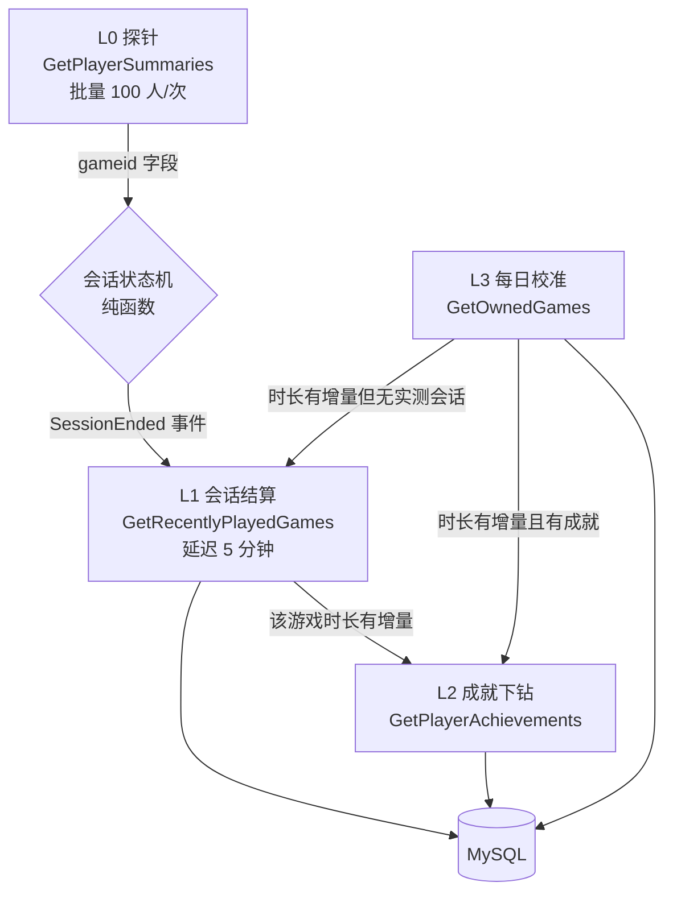
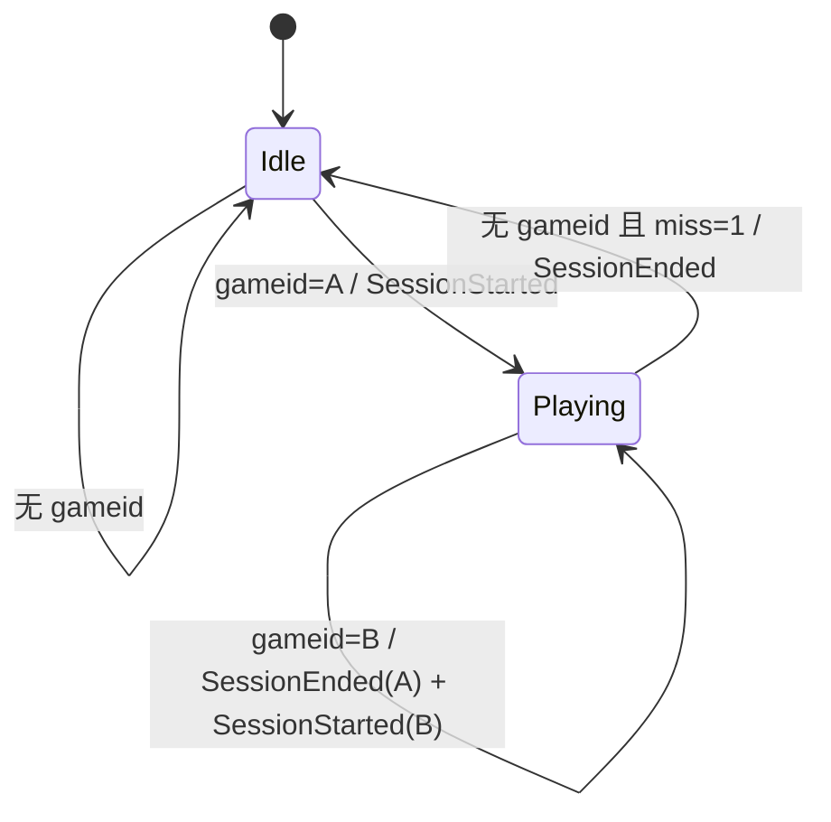
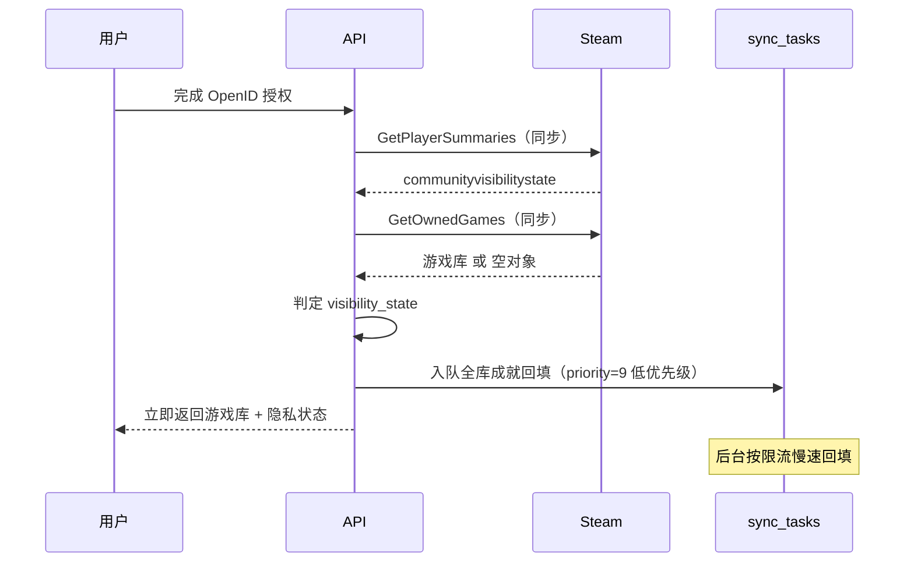

# Steam 账号关联与游戏数据采集 · 设计文档

| 项 | 值 |
|---|---|
| 版本 | v1.0 |
| 日期 | 2026-08-26 |
| 状态 | 已评审 |

---

## 1. 概述

为多用户 Web 服务提供 Steam 账号关联能力，在关联后持续采集该账号的**游戏库**、**成就**与**游戏时长**，并把时长采集成带起止时刻的游戏会话事件流。

### 1.1 功能需求

| 编号 | 需求 | 说明 |
|---|---|---|
| F1 | 账号关联 | 用户通过 Steam 官方 OpenID 2.0 授权，将其 Steam 账号绑定到本站账号 |
| F2 | 游戏库列表 | 展示用户拥有的全部游戏，含名称、图标、累计时长、最后游玩时间 |
| F3 | 游戏成就 | 全库完整成就数据：每款游戏的全部成就定义、用户解锁状态与解锁时刻 |
| F4 | 时长监控 | 持续监控账号的游戏行为，产出「何时玩了哪款游戏、玩了多久」的会话事件流 |

### 1.2 规模与指标

| 项 | 目标 |
|---|---|
| 绑定用户量 | 100 ~ 1,000 |
| 时长监控实时性 | 活跃用户 2 分钟粒度；非活跃用户按分层降频 |
| 成就覆盖 | 全库完整（含未解锁成就与全球解锁率） |
| 历史数据 | 完整会话事件流，永久保留 |
| Steam API 日调用量 | 稳态 < 5,000 次/天（配额上限 100,000） |

---

## 2. 平台约束

以下是 Steam 平台的硬性限制，它们直接决定了本设计的形态。**这些约束不可绕过，任何方案都必须在其之上构建。**

### 2.1 没有推送机制

Steam 不提供任何 Webhook、事件订阅或长连接推送。所有数据只能由客户端主动轮询拉取。

**推论**：时长监控本质上是「定期采样 + 快照差分」，数据精度的上限由轮询频率决定，不存在「实时准确」的可能。

### 2.2 OpenID 不返回访问凭证

Steam 的 OpenID 2.0 登录**只回传一个 SteamID64**，不返回用户信息，也不返回任何 access token 或 refresh token。

**推论**：「绑定」在技术上的含义是*验证了这个 SteamID 归该用户所有*，而非*获得了访问其数据的授权*。绑定完成后，所有数据仍然由服务端使用**自己的 API Key** 去读取该 SteamID 的**公开**数据。

### 2.3 隐私墙是静默的

Steam 有两个互相独立的隐私开关，用户常常只设置了其中之一：

| 开关 | 影响的接口 | 关闭时的表现 |
|---|---|---|
| 个人资料公开性 | `GetPlayerSummaries` | `communityvisibilitystate != 3` |
| **游戏详情**公开性 | `GetOwnedGames`、`GetPlayerAchievements` | 返回空对象 `{"response":{}}` 或 `success:false` |

关键在于：**这些都是 HTTP 200 响应**，不是错误码。天真的实现会认为「调用成功了，只是这个用户没有游戏」，导致用户绑定成功却看到空白页面且无从排查。

### 2.4 配额

单个 API Key 限 **100,000 次调用/天**（见 `https://steamcommunity.com/dev/apiterms`）。此外存在未公开的短期速率限制，社区实测持续 1 req/s 绝对安全，突发超过 10 req/s 会触发 429。

### 2.5 接口能力差异

| 接口 | 是否可批量 | 说明 |
|---|---|---|
| `GetPlayerSummaries` | **是，最多 100 个 SteamID/次** | 本设计的成本支点 |
| `GetOwnedGames` | 否，单用户 | 响应体大（数百款游戏） |
| `GetPlayerAchievements` | 否，**单用户单游戏** | 成就成本的来源 |
| `GetSchemaForGame` | 否，单游戏，**但与用户无关** | 可全局共享缓存 |

`GetPlayerAchievements` 不能批量这一点，决定了全库成就必须异步回填，不可能在绑定时同步完成。

### 2.6 时长数据的结算延迟

`playtime_forever` 在游戏退出后才最终结算，游戏运行中的数值不实时。会话结束后立即查询会拿到旧值。

---

## 3. 边界与非目标

### 3.1 明确不做

| 不做 | 原因 |
|---|---|
| 读取用户的私密数据 | 平台不提供该能力，OpenID 不授予任何数据权限 |
| 读取好友列表、库存、市场交易 | 超出本期需求范围 |
| 反作弊、游戏内数据、实时对局信息 | 平台不提供 |
| Steam 客户端本地文件解析 | 服务端产品，无客户端 |
| 精确到秒的时长 | 平台数据本身为分钟粒度 |

### 3.2 已知的精度损失（可接受的降级）

设计中存在若干无法消除的精度损失，此处显式列出，作为验收时的预期基准：

| 场景 | 后果 | 缓解 |
|---|---|---|
| 会话短于探针间隔（如 90 秒） | 探针观测不到该会话 | L3 每日校准通过时长差值补一条推断会话 |
| 用户设置为「离线/隐身」 | 探针读不到 `gameid`，观测不到会话 | 同上 |
| 会话起止时刻 | 最多有一个探针周期的误差 | 以 Steam 的时长增量为准反推起止时刻 |
| 5 分钟内重复游玩同一游戏 | 两局可能被合并为一局 | 接受。见 §6.4 任务合并语义 |
| 校准补出的会话 | 只有时长可信，起止时刻为推断值 | 落库时标记 `source=reconcile`，前端区别展示 |

**原则：推断出来的数据必须在数据模型层面与实测数据区分开，不允许伪装成实测值。**

---

## 4. 技术架构

### 4.1 技术栈

| 层 | 选型 |
|---|---|
| 语言 | Go |
| HTTP 框架 | Gin |
| ORM | GORM |
| 主存储 | MySQL 8（utf8mb4 / utf8mb4_0900_ai_ci） |
| 缓存与限流 | Redis 7 |
| 异步任务 | **不引入消息队列**，采用本地事务表 + 定时扫描补偿 |
| 配置 | YAML 分环境配置，`spf13/viper` 加载，敏感项由环境变量覆盖 |
| 日志 | 标准库 `log/slog` 结构化日志 |

### 4.2 为什么不用消息队列

1000 用户规模下每天的任务量约数千条，远未达到需要专用队列中间件的量级。使用 MySQL 本地事务表带来三个直接收益：

- **任务与业务数据在同一事务内写入**，不存在「业务成功但任务丢失」的分布式一致性问题
- 少一个中间件即少一套运维与一个故障点
- 任务状态可直接用 SQL 查询与排障

代价是吞吐上限较低。到万级用户规模时再替换，届时 `internal/task` 的接口不需要变动。

### 4.3 进程与包结构

```
cmd/
  api/                Gin HTTP 服务：OpenID 登录、数据查询接口
  worker/             采集进程，可多实例水平扩展
configs/
  config.yaml         基础配置，所有环境共享
  config.dev.yaml     开发环境覆盖项
  config.prod.yaml    生产环境覆盖项
scripts/
  db/
    init.sql          初始化 DDL
    migrations/       后续增量变更脚本
  dev/                本地开发辅助脚本
internal/
  config/             viper 加载与校验
  logging/            slog Logger 构造
  steam/              Steam Web API 客户端 —— 唯一对外发起请求的包
  domain/             会话状态机与业务规则（纯函数，无 IO）
  collector/          L0–L3 各层 job 处理器
  task/               本地事务表：入队、扫描、租约、退避重试
  auth/               OpenID 2.0 验证 + 签名 state
  store/              GORM repository
  api/                Gin handler 与 DTO
```

### 4.4 两条关键的隔离边界

**边界一：`internal/steam` 是唯一的网络出口。**

限流、重试、配额记账，以及把 Steam 那些「HTTP 200 但内容表示失败」的伪成功响应归一化为真实错误，全部封装在此包内。对外只暴露领域化的接口与哨兵错误：

```go
type Client interface {
    GetPlayerSummaries(ctx context.Context, ids []uint64) ([]PlayerSummary, error)
    GetOwnedGames(ctx context.Context, id uint64) ([]OwnedGame, error)
    GetRecentlyPlayedGames(ctx context.Context, id uint64) ([]OwnedGame, error)
    GetPlayerAchievements(ctx context.Context, id uint64, appID uint32) ([]PlayerAchievement, error)
    GetSchemaForGame(ctx context.Context, appID uint32) (GameSchema, error)
}

var (
    ErrProfilePrivate = errors.New("steam: profile is not public")
    ErrAppHasNoStats  = errors.New("steam: app has no achievement stats")
    ErrRateLimited    = errors.New("steam: rate limited")
)
```

上层代码永远不需要知道 Steam 返回的原始 JSON 是什么形状。

**边界二：`internal/domain` 的会话状态机是纯函数。**

```go
func Advance(prev State, sample Probe, now time.Time) (State, []Event)
```

不访问数据库、不发起网络请求、时钟作为参数传入。这使得 §6.2 列举的全部边界情况都能通过表驱动测试穷举验证。该状态机是整个系统中最容易出错、且错误后果最隐蔽（静默产生错误数据）的部分，因此必须保持可完整测试。

### 4.5 存储职责划分

**MySQL 存真相，Redis 只存可重建的数据。**

这条线必须划死：会话状态（`probe_state`）绝不能放 Redis —— 它一旦丢失会直接导致错误的游戏会话记录被写入历史事件流，而事件流是永久保留的。

Redis 承担三项职责，全部可在丢失后重建：

| 用途 | 数据结构 | 说明 |
|---|---|---|
| 全局限流 | Lua 令牌桶 | 多 worker 实例共享同一个 Steam 调用速率闸门 |
| 每日配额 | `steam:quota:{date}` 计数器 + EXPIRE | 逼近上限时自动降级 |
| 成就 Schema 缓存 | `steam:schema:{appid}` | 成就定义几乎不变，避免反复查库 |

### 4.6 配置管理

配置采用「基础 YAML + 环境覆盖 + 共享 env + 环境变量」四层结构，由 viper 按顺序合并：

```
configs/config.yaml          ← 基础值，所有环境共享
configs/config.{env}.yaml    ← 环境差异项，覆盖基础值
deploy/demo/env/{env}.env    ← 跨服务连接信息与服务私有密钥，不进 Git
真实进程环境变量               ← 最高优先级
```

环境由 `APP_ENV` 选择（默认 `local`）。共享目录可通过 `PLAYPILOT_CONFIG_DIR` 覆盖。

**敏感项一律不写入 YAML。** `steam.api_key`、`mysql.password`、`auth.state_secret` 三项在 YAML 中留空，由环境变量在部署时注入：

| 配置键 | 对应环境变量 |
|---|---|
| `steam.api_key` | `STEAMLINK_STEAM_API_KEY` |
| `mysql.password` | `PLAYPILOT_MYSQL_PASSWORD` |
| `auth.state_secret` | `STEAMLINK_AUTH_STATE_SECRET` |

原因很实际：`configs/` 目录会被提交到仓库，Steam API Key 一旦泄漏，攻击者可以用它耗尽你的日配额；`state_secret` 泄漏则可以伪造 CSRF state，诱导受害者把 Steam 账号绑定到攻击者的本站账号上。

配置加载完成后必须做一次显式校验：三个敏感项为空时直接启动失败，而不是等到第一次调用 Steam 才报错。**启动即失败远好于运行时才暴露配置缺失**——后者会让服务带着残缺配置对外提供服务。

### 4.7 日志

使用标准库 `log/slog`，全部结构化输出，禁止 `fmt.Printf` 与 `log.Printf`。

| 环境 | Handler | 级别 |
|---|---|---|
| dev | `slog.NewTextHandler` | Debug |
| prod | `slog.NewJSONHandler` | Info |

两条约定：

**SteamID 在日志中以字符串输出。** 与对外 JSON 同理，`slog.String("steam_id", strconv.FormatUint(id, 10))`，避免日志采集链路（多数经过 JSON）静默丢精度。

**Logger 通过依赖注入传递，不使用 `slog.Default()`。** `task.Runner`、各 collector 都持有自己的 `*slog.Logger`，并用 `logger.With("component", "prober")` 附加固定字段。这让测试可以注入 `slog.New(slog.DiscardHandler)` 静默输出，也让生产日志天然带上来源标识。

---

## 5. 数据模型

### 5.1 完整 DDL

以下内容即 `scripts/db/init.sql` 的正文。后续的表结构变更以增量脚本形式放入 `scripts/db/migrations/`，按 `NNN_描述.sql` 命名，不直接修改 `init.sql`——否则已部署环境与新建环境会产生结构漂移。

```sql
-- ============ 账号绑定 ============
CREATE TABLE steam_links (
  user_id           BIGINT UNSIGNED NOT NULL COMMENT '本站用户 ID',
  steam_id64        BIGINT UNSIGNED NOT NULL COMMENT 'SteamID64',
  visibility_state  TINYINT NOT NULL DEFAULT 0
                    COMMENT '0=未探测 1=正常 2=资料私密 3=游戏详情私密',
  private_strikes   TINYINT NOT NULL DEFAULT 0 COMMENT '连续探测到私密的次数',
  linked_at         DATETIME NOT NULL,
  last_verified_at  DATETIME DEFAULT NULL,
  unlinked_at       DATETIME DEFAULT NULL COMMENT '软删除标记',
  created_at        DATETIME NOT NULL,
  updated_at        DATETIME NOT NULL,
  -- 生成列：仅未解绑的记录参与唯一约束，允许 Steam 账号解绑后被他人重新绑定
  active_steam_id   BIGINT UNSIGNED
                    GENERATED ALWAYS AS (IF(unlinked_at IS NULL, steam_id64, NULL)) VIRTUAL,
  PRIMARY KEY (user_id),
  UNIQUE KEY uk_active_steam (active_steam_id),
  KEY idx_steam_id (steam_id64)
) ENGINE=InnoDB DEFAULT CHARSET=utf8mb4 COLLATE=utf8mb4_0900_ai_ci;

-- ============ 全局共享的游戏元数据（不带用户维度）============
CREATE TABLE apps (
  appid             INT UNSIGNED NOT NULL,
  name              VARCHAR(255) NOT NULL DEFAULT '',
  img_icon_url      VARCHAR(64) NOT NULL DEFAULT '',
  has_achievements  TINYINT NOT NULL DEFAULT -1 COMMENT '-1=未知 0=无成就 1=有成就',
  ach_total         SMALLINT UNSIGNED NOT NULL DEFAULT 0,
  schema_synced_at  DATETIME DEFAULT NULL,
  created_at        DATETIME NOT NULL,
  updated_at        DATETIME NOT NULL,
  PRIMARY KEY (appid)
) ENGINE=InnoDB DEFAULT CHARSET=utf8mb4 COLLATE=utf8mb4_0900_ai_ci;

CREATE TABLE app_achievements (
  appid         INT UNSIGNED NOT NULL,
  api_name      VARCHAR(128) NOT NULL COMMENT 'Steam 的 apiname，稳定标识',
  display_name  VARCHAR(255) NOT NULL DEFAULT '',
  description   VARCHAR(1024) NOT NULL DEFAULT '',
  icon          VARCHAR(255) NOT NULL DEFAULT '',
  icon_gray     VARCHAR(255) NOT NULL DEFAULT '',
  hidden        TINYINT NOT NULL DEFAULT 0,
  global_pct    DECIMAL(6,3) NOT NULL DEFAULT 0 COMMENT '全球解锁率百分比',
  created_at    DATETIME NOT NULL,
  updated_at    DATETIME NOT NULL,
  PRIMARY KEY (appid, api_name)
) ENGINE=InnoDB DEFAULT CHARSET=utf8mb4 COLLATE=utf8mb4_0900_ai_ci;

-- ============ 用户 × 游戏 当前快照 ============
CREATE TABLE user_games (
  steam_id64            BIGINT UNSIGNED NOT NULL,
  appid                 INT UNSIGNED NOT NULL,
  playtime_forever_min  INT UNSIGNED NOT NULL DEFAULT 0,
  playtime_2weeks_min   INT UNSIGNED NOT NULL DEFAULT 0,
  rtime_last_played     DATETIME DEFAULT NULL,
  ach_unlocked          SMALLINT UNSIGNED NOT NULL DEFAULT 0,
  ach_total             SMALLINT UNSIGNED NOT NULL DEFAULT 0,
  ach_synced_at         DATETIME DEFAULT NULL,
  first_seen_at         DATETIME NOT NULL COMMENT '首次出现在库中，用于识别新购入',
  created_at            DATETIME NOT NULL,
  updated_at            DATETIME NOT NULL,
  PRIMARY KEY (steam_id64, appid),
  KEY idx_playtime (steam_id64, playtime_forever_min DESC),
  KEY idx_ach_sync (ach_synced_at)
) ENGINE=InnoDB DEFAULT CHARSET=utf8mb4 COLLATE=utf8mb4_0900_ai_ci;

-- ============ 时序事件流（append-only）============
CREATE TABLE play_sessions (
  id            BIGINT UNSIGNED NOT NULL AUTO_INCREMENT,
  steam_id64    BIGINT UNSIGNED NOT NULL,
  appid         INT UNSIGNED NOT NULL,
  started_at    DATETIME NOT NULL,
  ended_at      DATETIME NOT NULL,
  duration_min  INT UNSIGNED NOT NULL,
  source        TINYINT NOT NULL COMMENT '1=probe 实测 2=reconcile 推断',
  created_at    DATETIME NOT NULL,
  PRIMARY KEY (id),
  -- 防止租约回收导致任务重跑时写入重复会话
  UNIQUE KEY uk_session (steam_id64, appid, started_at),
  KEY idx_user_time (steam_id64, started_at DESC)
) ENGINE=InnoDB DEFAULT CHARSET=utf8mb4 COLLATE=utf8mb4_0900_ai_ci;

CREATE TABLE achievement_unlocks (
  steam_id64   BIGINT UNSIGNED NOT NULL,
  appid        INT UNSIGNED NOT NULL,
  api_name     VARCHAR(128) NOT NULL,
  unlocked_at  DATETIME NOT NULL COMMENT '取 Steam 的 unlocktime，精确值',
  created_at   DATETIME NOT NULL,
  PRIMARY KEY (steam_id64, appid, api_name),
  KEY idx_user_time (steam_id64, unlocked_at DESC)
) ENGINE=InnoDB DEFAULT CHARSET=utf8mb4 COLLATE=utf8mb4_0900_ai_ci;

-- ============ 探针状态（会话状态机的持久化）============
CREATE TABLE probe_state (
  steam_id64            BIGINT UNSIGNED NOT NULL,
  current_appid         INT UNSIGNED DEFAULT NULL COMMENT 'NULL 表示 Idle',
  session_started_at    DATETIME DEFAULT NULL,
  last_seen_playing_at  DATETIME DEFAULT NULL COMMENT '最后一次观测到在玩，用作 ended_at',
  miss_count            TINYINT NOT NULL DEFAULT 0 COMMENT '去抖计数',
  tier                  TINYINT NOT NULL DEFAULT 3,
  last_probe_at         DATETIME DEFAULT NULL,
  next_probe_at         DATETIME NOT NULL,
  updated_at            DATETIME NOT NULL,
  PRIMARY KEY (steam_id64),
  KEY idx_next_probe (next_probe_at)
) ENGINE=InnoDB DEFAULT CHARSET=utf8mb4 COLLATE=utf8mb4_0900_ai_ci;

-- ============ 本地事务表（异步任务与补偿的核心）============
CREATE TABLE sync_tasks (
  id            BIGINT UNSIGNED NOT NULL AUTO_INCREMENT,
  task_type     TINYINT NOT NULL
                COMMENT '1=库同步 2=成就同步 3=schema同步 4=会话结算',
  steam_id64    BIGINT UNSIGNED NOT NULL DEFAULT 0,
  appid         INT UNSIGNED NOT NULL DEFAULT 0,
  payload       JSON DEFAULT NULL COMMENT '会话结算携带 started_at / ended_at',
  priority      TINYINT NOT NULL DEFAULT 5 COMMENT '数值小者优先',
  status        TINYINT NOT NULL DEFAULT 0
                COMMENT '0=待执行 1=执行中 2=成功 3=待重试 4=死信',
  attempts      SMALLINT UNSIGNED NOT NULL DEFAULT 0,
  next_run_at   DATETIME NOT NULL COMMENT '统一调度时间轴，执行中时兼作租约到期时刻',
  last_error    VARCHAR(512) NOT NULL DEFAULT '',
  created_at    DATETIME NOT NULL,
  updated_at    DATETIME NOT NULL,
  PRIMARY KEY (id),
  UNIQUE KEY uk_task (task_type, steam_id64, appid),
  KEY idx_scan (status, next_run_at, priority)
) ENGINE=InnoDB DEFAULT CHARSET=utf8mb4 COLLATE=utf8mb4_0900_ai_ci;
```

### 5.2 模型设计要点

**（1）`apps` / `app_achievements` 是全局表，不带用户维度。**

1000 个用户可能共同拥有约 5,000 款不同游戏。成就定义（名称、描述、图标）是所有用户共享的，因此只需按 appid 拉取一次。这是整个方案中最大的一笔配额节省 —— 若按用户维度存储，成就 Schema 的调用量会放大三个数量级。

**（2）`achievement_unlocks` 天然幂等。**

主键为 (用户, 游戏, 成就名)，解锁时刻直接取 Steam 返回的 `unlocktime`（Unix 时间戳，精确值）。重复同步使用 `INSERT ... ON DUPLICATE KEY UPDATE` 即可，不需要任何 diff 逻辑。

注意成就与时长的本质差异：**成就自带精确时间戳，无需推断；时长没有，只能靠采样差分**。

**（3）`play_sessions.source` 区分数据可信度。**

`1=probe` 是探针捕获的实测会话，有可信的起止时刻；`2=reconcile` 是每日校准推断出来的，只有时长可信。这两者在前端必须区别展示，不能混为一谈。

**（4）`sync_tasks` 是状态表，不是日志表。**

`uk_task(task_type, steam_id64, appid)` 唯一键意味着每个任务标识永远只有一行，反复复用：

```sql
INSERT INTO sync_tasks (...) VALUES (...)
ON DUPLICATE KEY UPDATE
  status      = 0,
  attempts    = 0,
  next_run_at = LEAST(next_run_at, VALUES(next_run_at));
```

带来三个好处：入队天然幂等、表大小有上界（约用户数 × 游戏数量级，1000 用户约 20 万行）、无需清理归档任务。

**（5）`steam_links.active_steam_id` 生成列。**

MySQL 不支持 PostgreSQL 那样的部分唯一索引。利用「NULL 不参与唯一约束」的特性，用生成列实现「仅未解绑记录唯一」，从而允许 Steam 账号在解绑后被另一个本站账号重新绑定。

注意游戏数据表（`user_games`、`play_sessions`、`achievement_unlocks`）均以 `steam_id64` 为主键前缀而非 `user_id` —— **游戏数据归属于 Steam 账号，不归属于本站账号**。账号转手时历史数据跟随 Steam 账号，这是正确的语义。

### 5.3 两个 Go / MySQL 特有的陷阱

**必须使用 utf8mb4。** Steam 游戏名中 emoji 与特殊符号极为常见，`utf8`（实为 utf8mb3）会直接写入失败。

**SteamID64 返回前端必须序列化为字符串。** SteamID64 约为 7.6×10¹⁶，超过 JavaScript 的 `Number.MAX_SAFE_INTEGER`（9.007×10¹⁵）。直接以数字返回会在前端**静默丢失精度**，变成一个不存在的账号 ID。Go 侧统一使用：

```go
SteamID uint64 `json:"steam_id,string"`
```

---

## 6. 采集管线设计

### 6.1 整体分层

采集分为四层，每层的触发条件由上一层观测到的**变化**驱动，而非定时全量扫描：



| 层 | 接口 | 触发方式 | 职责 |
|---|---|---|---|
| L0 | `GetPlayerSummaries` | 按 tier 定时，批量 100 人 | 检测「谁正在玩什么」 |
| L1 | `GetRecentlyPlayedGames` | SessionEnded 事件触发，延迟 5 分钟 | 获取精确时长增量，落会话 |
| L2 | `GetPlayerAchievements` | 该游戏时长有增量时触发 | 同步成就解锁 |
| L3 | `GetOwnedGames` | 每用户每日一次 | 同步游戏库 + 兜底补漏 |

**L0 是整个方案的成本支点**：一次请求覆盖 100 个用户，1000 个用户全量探测一轮只需 10 次调用。这使得高频轮询在配额上变得几乎免费。

### 6.2 L0 会话状态机

只读取 `GetPlayerSummaries` 响应中的一个字段：`gameid`（用户不在玩游戏时，该字段**不存在**，而非为空值）。

状态为 `Idle` 或 `Playing(appid, startedAt, missCount)`：



完整转移表：

| 当前状态 | 观测 | 新状态 | 产出事件 |
|---|---|---|---|
| Idle | 无 gameid | Idle | — |
| Idle | gameid=A | Playing(A, now, 0) | SessionStarted(A) |
| Playing(A) | gameid=A | Playing(A, 原 startedAt, 0) | — |
| Playing(A) | 无 gameid, miss=0 | Playing(A, 原 startedAt, **1**) | —（去抖） |
| Playing(A) | 无 gameid, miss=1 | Idle | SessionEnded(A, lastSeenPlayingAt) |
| Playing(A) | gameid=B | Playing(B, now, 0) | SessionEnded(A) + SessionStarted(B) |

**去抖不是优化，是必需的。** Steam 的 summaries 接口偶发返回不完整数据，缺少去抖时，一次网络抖动就会把一局连续游戏切割成多段碎片会话。必须连续两轮观测不到 `gameid` 才判定会话结束，且 `ended_at` 回填为 `last_seen_playing_at`（最后一次观测到在玩的时刻），而非当前时刻。

### 6.3 六个必须处理的边界情况

**（1）探针请求失败 ≠ 用户没在玩。**

整批请求超时或返回 5xx 时，**绝不能**把「没有数据」喂给状态机 —— 那会导致这一批 100 个用户的会话被同时误判为结束。请求失败时直接跳过本轮，所有状态保持不变。

这是 §4.4 要求 `internal/steam` 严格区分「错误」与「空结果」的根本原因。

**（2）短会话漏采。** 时长短于探针间隔的会话（如 90 秒）L0 永远观测不到 → 由 L3 校准通过时长差值补一条 `source=reconcile` 会话。

**（3）隐身用户。** 用户将在线状态设为「离线」时，即使正在游玩，`gameid` 也不返回 → 同样由 L3 兜底。

**（4）起止时刻不精确。** 2 分钟的轮询间隔意味着 `started_at` 最多有 2 分钟误差。解决方式是**不信任探针推算的时长，只信任 Steam 提供的时长**：L1 结算时以 `playtime_forever` 的真实增量作为 `duration`，再反推 `started_at = ended_at - duration`。

**（5）超长挂机。** 会话持续超过 24 小时时强制结算并开启新会话，避免单条异常记录污染统计。

**（6）时钟。** 探针响应不含服务端时间戳，使用 worker 本地时间，要求部署机器启用 NTP 同步。

### 6.4 L1 会话结算：刻意延迟 5 分钟

由于 §2.6 的结算延迟，SessionEnded 事件不直接写库，而是入本地事务表：

```
sync_tasks(task_type=4, steam_id64, appid,
           payload={started_at, ended_at},
           priority=1, next_run_at=NOW() + 5min)
```

本地事务表在此天然充当了延迟队列。5 分钟后执行：

1. 调用 `GetRecentlyPlayedGames`
2. 定位对应 appid 的 `playtime_forever`
3. 与 `user_games.playtime_forever_min` 取差值 = 本次会话真实时长
4. 写 `play_sessions`（`source=1`，`started_at = ended_at - duration`）
5. 更新 `user_games.playtime_forever_min`
6. 若 `apps.has_achievements = 1`，入队 L2 成就同步任务

**任务合并语义**：`uk_task` 唯一键意味着若用户在这 5 分钟内又玩了同一款游戏，两次结算任务会合并，两局被记为一局。这是已知且接受的降级（见 §3.2）。

### 6.5 L2 成就下钻：三类错误必须区分

`GetPlayerAchievements` 的失败有三种语义完全不同的情况，**混淆它们是本模块最容易犯的错误**：

| Steam 返回 | 含义 | 正确处理 |
|---|---|---|
| `success:false, error:"Profile is not public"` | 隐私墙 | 停止该用户全部同步，更新 `visibility_state`，引导用户修改设置 |
| `success:false, error:"Requested app has no stats"` | 该游戏本身没有成就系统 | 置 `apps.has_achievements=0`，任务标记为**成功**，永不重试 |
| 5xx / 超时 / 连接错误 | 真实故障 | 指数退避重试 |

若把第二类当作失败重试，那些没有成就系统的游戏（在任何用户的库中都占相当比例）会陷入死循环并持续消耗配额。

执行流程：

1. 确保 `app_achievements` 中已有该 appid 的 Schema（否则先执行 `task_type=3`）
2. 调用 `GetPlayerAchievements`
3. 对 `achieved=1` 的项批量 upsert 到 `achievement_unlocks`，`unlocked_at` 取 `unlocktime`
4. 更新 `user_games.ach_unlocked` / `ach_total` / `ach_synced_at`

### 6.5.1 Schema 同步（`task_type=3`）

成就定义与全球解锁率都是 appid 维度的全局数据，在同一个任务中一并拉取：

| 数据 | 接口 | 落库字段 |
|---|---|---|
| 成就定义 | `GetSchemaForGame` | `app_achievements` 的名称、描述、图标、隐藏标记 |
| 全球解锁率 | `GetGlobalAchievementPercentagesForApp` | `app_achievements.global_pct` |

两者的重要性不同：**成就定义是主数据，全球解锁率只是展示用的稀有度指标**。因此解锁率拉取失败时不应让整个 Schema 任务失败重试 —— 定义已经写入就算成功，稀有度留待下次同步补齐。

`GetGlobalAchievementPercentagesForApp` 有两处与其他接口不同：参数名是 `gameid` 而非 `appid`，且不需要 API Key。

### 6.6 L3 每日校准

每用户每日一次 `GetOwnedGames(include_appinfo=1, include_played_free_games=1)`：

1. 批量 upsert 全部 `user_games`，顺带发现新购入的游戏（`first_seen_at` 为空即为新增）
2. 逐款比对 `playtime_forever` 差值：**有增量但当日没有对应的实测会话** → 补一条 `source=2` 的推断会话，以 `rtime_last_played` 作为 `ended_at` 锚点，`started_at` 由时长反推
3. 时长有变化且该游戏有成就 → 入队 L2

`rtime_last_played` 字段是此层的关键 —— 它让推断出来的会话也拥有一个可信的时间落点，而不是只能笼统地归属到「某一天」。

### 6.7 分层策略与配额实测

| tier | 判据 | 探针间隔 |
|---|---|---|
| 0 活跃 | 24 小时内有游玩 | 2 分钟 |
| 1 近期 | 7 天内有游玩 | 15 分钟 |
| 2 休眠 | 30 天内有游玩 | 2 小时 |
| 3 沉睡 | 超过 30 天 | 1 天 |

tier 仅控制 `next_probe_at` 的步进值。调度器取出所有 `next_probe_at <= NOW()` 的用户后，按 100 个一批调用 `GetPlayerSummaries`。

按 1000 用户、tier 分布 10% / 20% / 40% / 30% 估算稳态日调用量：

| 层 | 计算 | 次/天 |
|---|---|---|
| L0 探针 | 批量 100，各 tier 分别 720 / 96 / 12 / 1 轮 | ~963 |
| L1 会话结算 | 约 500 个会话/天 | ~500 |
| L2 成就下钻 | 会话触发 + 增量 | ~800 |
| L3 每日校准 | 1000 用户 × 1 | ~1,000 |
| Schema 同步 | 新游戏，日均数十 | ~50 |
| **合计** | | **~3,300（配额的 3.3%）** |

余量极大，足以并行执行新用户的全库成就回填。

### 6.8 冷启动：新用户绑定



绑定流程中**同步**完成的只有两次调用：隐私探测与游戏库拉取。用户在数秒内即可看到完整游戏库。

全库成就回填（N 款游戏 = N 条任务）以 `priority=9` 入队。低优先级是必需的 —— 一个新用户会一次性产生数百条任务，若与实时会话结算任务同级排队，会拖垮所有用户的实时性。扫描时按 `ORDER BY priority, next_run_at` 保证实时任务永远插队。

---

## 7. 账号绑定流程

### 7.1 OpenID 2.0 三步

Steam 的 endpoint：`https://steamcommunity.com/openid/login`

**第一步 · 重定向**

浏览器先访问 Gateway 的 `/noauth/steam/login`。Gateway 若能解析登录态，就把
可信 `X-User-Id` 注入 steam_link；steam_link 将该用户 ID 写入签名 state。
steam_link 不再解析 Cookie，也不再持有登录 SessionStore。

```
openid.ns          = http://specs.openid.net/auth/2.0
openid.mode        = checkid_setup
openid.return_to   = {base_url}/noauth/steam/callback?state=<signed>
openid.realm       = {base_url}
openid.identity    = http://specs.openid.net/auth/2.0/identifier_select
openid.claimed_id  = http://specs.openid.net/auth/2.0/identifier_select
```

`realm` 与 `return_to` 都由配置项 `http.base_url` 派生，两者存在强约束：**`return_to` 必须落在 `realm` 之下**（scheme、host、端口三者完全一致，路径在 realm 之内），否则 Steam 直接拒绝。注意端口是 realm 的组成部分，`http://localhost:8080` 与 `http://localhost` 是两个不同的 realm。

`identity` 与 `claimed_id` 填 `identifier_select`，意为「由用户在 Steam 侧选择身份」—— 本服务在发起时并不知道对方的 SteamID，正是要通过这次流程得知。

Steam 用 **302 把用户的浏览器**重定向回 `return_to`，携带一组 `openid.*` 参数，其中：

```
openid.claimed_id = https://steamcommunity.com/openid/id/76561198XXXXXXXXX
```

**这一步没有任何 Steam→本服务的服务端请求。** 所谓「回调」全程是浏览器重定向，`return_to` 只需要**用户的浏览器**能访问，不要求 Steam 的服务器能访问。这有两个直接推论：

- 本地开发用 `http://localhost:8080` 完全可行，不需要内网穿透
- 服务部署在反向代理后面时，`base_url` 必须是**用户看到的外部地址**，不能是内网地址

唯一需要本服务出网的是下面的第三步，方向恰好相反。

**第三步 · 验证（安全生命线，不可省略）**

由**本服务主动** POST 到 Steam：

将收到的**全部** `openid.*` 参数原样 POST 回同一 endpoint，仅将 `openid.mode` 改为 `check_authentication`。Steam 返回：

```
ns:http://specs.openid.net/auth/2.0
is_valid:true
```

**只有 `is_valid:true` 才可信任。** 跳过此步意味着任何人手工构造一个回调 URL 即可冒充任意 SteamID 登录 —— 这是 Steam 集成中最常见的安全漏洞，网络上流传的部分示例代码正是错误的。

从 `claimed_id` 提取 SteamID64 时必须校验完整前缀后再取那 17 位数字，不可简单按 `/` 分割取末段：

```go
var claimedIDRe = regexp.MustCompile(`^https://steamcommunity\.com/openid/id/(\d{17})$`)
```

**CSRF 防护**：将签名过的 state 编入 `return_to` 的查询串，回跳时校验。Steam 会原样回传 `return_to`，正好利用这一特性。

这一步之所以必需，是因为 **Steam OpenID 不需要任何预先注册** —— 不像 OAuth 要在服务商后台登记 redirect_uri 白名单，Steam 接受任意 `return_to`。也就是说任何人都能构造一条指向本站回调地址的 OpenID 请求，诱导受害者点击后把攻击者的 Steam 账号绑到受害者的本站账号上（或反之）。state 校验与第三步的 `check_authentication` 缺一不可。

另外，`base_url` 会作为 `realm` 显示在 Steam 的授权页面上，是用户判断「我正在授权给谁」的唯一依据，因此它必须是用户认得的正式域名。

### 7.2 绑定语义

| 场景 | 处理 |
|---|---|
| 首次绑定 | 插入 `steam_links`，初始化 `probe_state`，入队冷启动任务 |
| 该 Steam 账号已被他人绑定 | 返回明确业务错误码，而非 500 |
| 本站账号已绑定其他 Steam 账号 | 要求先解绑 |
| 解绑 | 置 `unlinked_at`，保留全部历史数据 |
| 重新绑定同一账号 | 置 `unlinked_at = NULL`，数据自动恢复 |

---

## 8. 隐私墙处理

### 8.1 三态判定

`visibility_state` 有三种状态，对应 §2.3 的两个独立开关：

| 值 | 含义 | 判定方式 | 可用数据 |
|---|---|---|---|
| 1 | 正常 | 两项探测均通过 | 全部 |
| 2 | 资料私密 | `communityvisibilitystate != 3` | 无 |
| 3 | 游戏详情私密 | `GetOwnedGames` 返回空对象 | 仅基础资料 |

**绑定成功后必须在 HTTP 请求内同步探测这两项**，立即给出反馈，而不是让用户绑定完面对一个空白页面无从判断原因。

### 8.2 产品化引导

对状态 2 和 3，前端给出精确的操作路径：

> Steam 客户端 → 个人资料 → 编辑资料 → 隐私设置 → 将「游戏详情」设为「公开」

并提供「我已修改，重新检测」按钮触发即时复检。

### 8.3 中途改为私密

已绑定用户随时可能关闭公开设置。L3 每日校准中若探测到私密错误，累加 `private_strikes`；连续 3 次后将该用户降级至 tier 3 并推送通知，避免无休止重试消耗配额。任一次探测成功即清零。

---

## 9. 可靠性设计

### 9.1 本地事务表的扫描与租约

统一使用 `next_run_at` 作为唯一调度时间轴。worker 领取任务时将 `status` 置为 1（执行中）**并将 `next_run_at` 推至 `NOW() + 5min`**，该值即兼作租约到期时刻。扫描条件因而无需 `OR`：

```sql
SELECT * FROM sync_tasks
WHERE status IN (0, 1, 3) AND next_run_at <= NOW()
ORDER BY priority, next_run_at
LIMIT 100
FOR UPDATE SKIP LOCKED;
```

- `status = 0 / 3` 且到期 → 正常执行
- `status = 1` 且到期 → 租约已过期，说明持有它的 worker 已崩溃，自动回收

**没有租约机制，任何一次 worker 异常退出（OOM、被 kill、机器重启）都会留下永久卡在「执行中」的任务。** `SKIP LOCKED` 则保证多 worker 实例并发扫描时不会取到同一条任务，无需额外的分布式锁。

### 9.2 重试与死信

```
next_run_at = NOW() + min(2^attempts × 30s, 6h)
```

`attempts > 8` 时置为 `status=4`（死信）并触发告警。

### 9.3 幂等性矩阵

| 写入对象 | 幂等机制 |
|---|---|
| `user_games` | 主键 upsert |
| `achievement_unlocks` | 主键 upsert，时间取自 Steam |
| `app_achievements` | 主键 upsert |
| `play_sessions` | **`uk_session(steam_id64, appid, started_at)` 唯一键** |
| `sync_tasks` 入队 | `uk_task` 唯一键 + `ON DUPLICATE KEY UPDATE` |

`play_sessions` 是唯一需要显式添加唯一键才能幂等的表 —— 它本是自增主键的追加表，而租约回收必然导致任务重跑，没有这个唯一键就会产生重复会话记录。

### 9.4 worker 长时间宕机后的状态自愈

worker 停机数小时后重启时，`probe_state` 中会残留一批卡在 `Playing` 状态的僵尸会话。启动时执行自愈扫描：

```sql
SELECT * FROM probe_state
WHERE current_appid IS NOT NULL
  AND last_probe_at < NOW() - INTERVAL 1 HOUR;
```

对这些记录强制结算并标记 `source=2`（推断）—— 这些会话的时长已不可信，不应冒充实测数据。

### 9.5 限流与降级（Redis）

| 机制 | 实现 | 阈值 |
|---|---|---|
| 令牌桶 | Redis Lua 脚本，原子取令牌 | 稳态 5 req/s，桶容量 20 |
| 每日配额 | `INCR steam:quota:{date}` + EXPIRE 48h | > 80,000 停 L2 回填；> 95,000 仅保留 L0 |
| 熔断 | 收到 429 时在 Redis 置 60 秒全局暂停标志 | 所有 worker 实例统一退避 |

令牌桶取 5 req/s 是在社区实测的安全值（1 req/s）与触发 429 的阈值（10+ req/s）之间留足余量的取值。

---

## 10. 测试策略

测试分层严格对应 §4.4 划定的隔离边界，每层测法不同：

| 层 | 方法 | 重点 |
|---|---|---|
| `internal/domain` 状态机 | **表驱动穷举** | §6.3 的六个边界情况全部覆盖。纯函数、时钟入参，无需任何 mock。这是全项目覆盖率要求最高之处 —— 它出错会静默产生错误数据 |
| `internal/steam` 客户端 | **真实畸形响应 fixture + httptest 回放** | 断言三类错误归一化正确 |
| `internal/task` 任务表 | **必须打真实 MySQL 8**（testcontainers） | `SKIP LOCKED` 与租约回收的行为在 mock 或 SQLite 上无法验证 |
| 端到端 | **假 Steam server 回放时间线** | 完整序列的最终落库结果 |

### 10.1 必备的 testdata fixture

以下都是 Steam 实际会返回的响应，必须存为测试数据：

```
空对象（游戏详情私密）      {"response":{}}
资料私密                    {"playerstats":{"error":"Profile is not public","success":false}}
无成就系统                  {"playerstats":{"error":"Requested app has no stats","success":false}}
缺失 gameid 字段的 summaries
含 emoji 的游戏名
```

### 10.2 任务表集成测试的核心场景

1. 两个 worker 并发扫描不会取到同一条任务
2. worker 崩溃后租约过期，任务被自动回收
3. 重复入队时 `uk_task` 冲突的合并逻辑正确

### 10.3 端到端场景

模拟完整时间线：开始游玩 → 持续 30 分钟 → 退出 → `playtime_forever` 延迟 5 分钟才更新。断言最终落库的 `play_sessions` 时长准确、`source=1`，且成就正确同步。

---

## 附录 A · Steam Web API 接口参考

Base URL：`https://api.steampowered.com`

| 接口 | 路径 | 关键参数 | 关键返回字段 |
|---|---|---|---|
| 玩家摘要 | `/ISteamUser/GetPlayerSummaries/v0002/` | `key`, `steamids`（逗号分隔，≤100） | `communityvisibilitystate`, `personastate`, `gameid`, `gameextrainfo` |
| 拥有的游戏 | `/IPlayerService/GetOwnedGames/v0001/` | `key`, `steamid`, `include_appinfo`, `include_played_free_games` | `game_count`, `appid`, `name`, `playtime_forever`, `playtime_2weeks`, `rtime_last_played`, `img_icon_url` |
| 近期游玩 | `/IPlayerService/GetRecentlyPlayedGames/v0001/` | `key`, `steamid`, `count` | 同上，仅含近两周游玩的游戏 |
| 玩家成就 | `/ISteamUserStats/GetPlayerAchievements/v0001/` | `key`, `steamid`, `appid`, `l` | `success`, `apiname`, `achieved`, `unlocktime` |
| 游戏成就定义 | `/ISteamUserStats/GetSchemaForGame/v2/` | `key`, `appid`, `l` | `name`, `displayName`, `description`, `icon`, `icongray`, `hidden` |
| 全球解锁率 | `/ISteamUserStats/GetGlobalAchievementPercentagesForApp/v0002/` | `gameid`（**无需 key**） | `name`, `percent` |
| 自定义 URL 解析 | `/ISteamUser/ResolveVanityURL/v0001/` | `key`, `vanityurl` | `steamid`, `success`（1=成功 42=未找到） |

**注意事项**

- `l` 参数控制成就名称与描述的语言，中文传 `schinese`
- 所有时长单位为**分钟**
- `unlocktime`、`rtime_last_played` 为 Unix 时间戳（秒）
- `personastate`：0=离线 1=在线 2=忙碌 3=离开 4=打盹 5=想交易 6=想玩游戏
- `communityvisibilitystate`：1=非公开 3=公开
- API Key 申请：`https://steamcommunity.com/dev/apikey`
- 使用条款与配额：`https://steamcommunity.com/dev/apiterms`

---

## 附录 B · 实施分期

| 阶段 | 内容 | 交付价值 |
|---|---|---|
| P1 | OpenID 绑定 + 隐私探测 + 游戏库展示 | 可演示，仅依赖 1 个 Steam 接口 |
| P2 | `sync_tasks` 框架 + L0 探针 + L1 结算 + L3 校准 | 时长监控跑通 |
| P3 | Schema 同步 + L2 下钻 + 全库回填 | 成就数据完整 |
| P4 | 分层 tier + 配额守卫 + 熔断 + 监控 | 抗压与配额优化 |

建议先落地 P1 并观察**隐私墙的实际命中率** —— 该比例会直接影响后续所有功能的价值评估。若大部分目标用户的游戏详情是非公开的，整个产品的假设需要重新审视。

详见 `02-implementation.md`。
